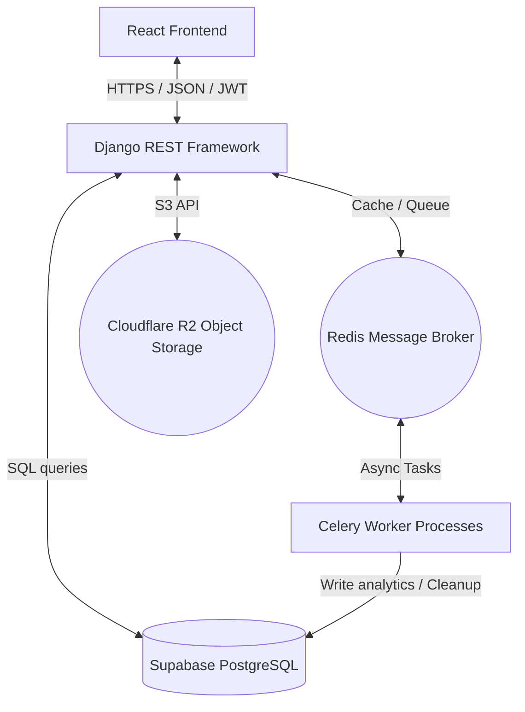

# Acta - Production-Ready REST API Backend

[Acta Frontend](https://github.com/oluwaseyipd/acta-frontend)

<p align="center">
  
  
  
  
  
  
  
  
</p>

---

## 🌊 Introduction

This repository contains the backend for **Acta**, a robust, scalable task management and analytics ecosystem. It is designed to act as a production-grade REST API, coordinating JWT sessions, Google Single Sign-On, async analytics computation via worker queues, and media storage serving.

---

## 🏗️ System Architecture



---

## 🛠️ Core Engineering Features

The system is architected around security, speed, and asynchronous processing:

### 1. Advanced JWT Auth & Google SSO
* **JWT Rotation**: Fully secure REST API authentication using SimpleJWT. Supports automatic token rotation on refreshing, session blacklisting on logout, and configurable lifetimes.
* **Google OAuth2 SSO**: Implements backend authorization handlers for Google identity tokens, matching and binding social profiles to native system users safely.

### 2. Async Workers (Celery & Redis)
* **Periodic Tasks**: Background worker workers process heavy read/write metrics without blocking API response times.
* **Productivity Scores**: Runs daily and weekly calculation workers to aggregate user task velocity, overdue metrics, and calculate a custom productivity score.
* **Log Purges**: Celery beat cron tasks handle database maintenance and clean up expired tokens and metrics.

### 3. Cloud Object Storage (Cloudflare R2)
* **Multi-Storage Backend**: Built with `django-storages[s3]`.
* **Isolated Media**: Local static files are compiled and served via WhiteNoise, while user-uploaded media (avatars and attachments) are securely read and written to an S3-compatible Cloudflare R2 bucket.

### 4. Containerization & DevOps
* **Docker & Compose**: Pre-packaged containerization orchestrating Postgres, Redis, and Web servers.
* **Multi-Process Container**: Employs **Supervisor** (`supervisord.conf`) within the Web container to run both the Gunicorn WSGI server and the Celery background worker process concurrently, reducing hosting complexity.
* **Render Blueprint**: Configured with `render.yaml` for instant Git-to-Cloud deployment.

---

## 📡 API Endpoint Catalog

All routes are versioned and prefixed with `/api/v1/`.

| Component | Endpoint | Method | Description |
| :--- | :--- | :---: | :--- |
| **Auth** | `/auth/register/` | `POST` | User registration & initial JWT issue |
| | `/auth/login/` | `POST` | User login (returns access & refresh tokens) |
| | `/auth/token/refresh/` | `POST` | Generates a new access token via refresh token |
| | `/auth/logout/` | `POST` | Blacklists refresh token and clears session |
| | `/auth/google/url/` | `GET` | Generates Google OAuth authorization URL |
| | `/auth/google/callback/` | `POST` | Authenticates Google code and exchanges for tokens |
| **Profile**| `/users/profile/` | `GET` | Fetches authenticated user's profile metadata |
| | `/users/profile/` | `PATCH`| Updates bio, timezone, and uploads avatar to R2 |
| **Tasks** | `/tasks/` | `GET` | Fetches, searches, and filters tasks (paginated) |
| | `/tasks/` | `POST` | Creates a new task |
| | `/tasks/<id>/` | `PATCH`| Partially updates a task (status, priority, due date) |
| | `/tasks/<id>/` | `DELETE`| Deletes a task |
| | `/tasks/<id>/comments/`| `POST` | Adds a text comment to a specific task |
| | `/tasks/<id>/attachments/`| `POST` | Uploads a task attachment file to R2 storage |
| **Stats** | `/analytics/` | `GET` | Retrieves computed daily/weekly productivity metrics |

---

## 📁 Project Structure

```text
acta-backend/
├── Acta_backend/              # Project settings and routing configurations
├── accounts/                  # User accounts, custom profiles, signals, and authentication
├── tasks/                     # Task, category, comment, and attachment components
├── analytics/                 # Daily/Weekly stats, Celery calculation & cleanup tasks
├── core/                      # Core models and custom REST permissions
├── static/ & staticfiles/     # Base assets and collected static assets
├── tests/                     # Project integration and unit test suite
├── Dockerfile & compose.yml   # Multi-container orchestration configurations
├── render.yaml                # Render cloud deployment blueprint
└── supervisord.conf           # Process coordinator (Web + Celery)
```

---

## 🧪 Setup & Installation

### Local Setup
1. **Clone & Virtualenv:**
   ```bash
   git clone https://github.com/oluwaseyipd/acta-backend.git
   cd acta-backend
   python -m venv venv
   source venv/bin/activate  # On Windows: venv\Scripts\activate
   ```
2. **Install Packages:**
   ```bash
   pip install -r requirements.txt
   ```
3. **Configure Environment:**
   Create a `.env` file in the root directory:
   ```ini
   DEBUG=True
   DJANGO_SECRET_KEY=your_secret_key
   DJANGO_SETTINGS_MODULE=Acta_backend.settings.development
   DATABASE_URL=sqlite:///db.sqlite3
   REDIS_URL=redis://localhost:6379/0
   ```
4. **Migrate & Run:**
   ```bash
   python manage.py migrate
   python manage.py runserver
   ```

### Docker Setup
To run Gunicorn, Celery, Postgres, and Redis automatically:
```bash
docker-compose up --build -d
```

### Running Tests
We use Pytest for our test suite. To run it:
```bash
pytest --cov=.
```

---

## 📄 License

Distributed under the MIT License. See [LICENSE](LICENSE) for details.
